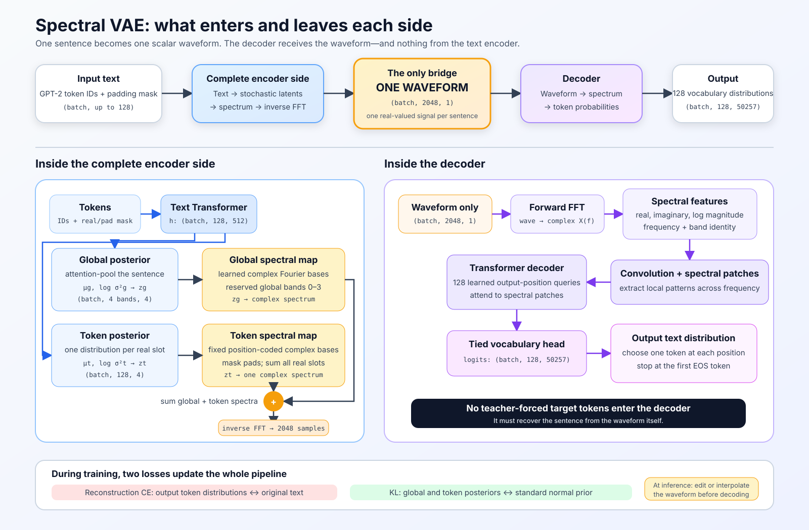

# Spectral variational autoencoder design

## Status

The unsupervised core described here is implemented as a standalone pipeline.
The existing CLIP model and `train_clip.py` remain a separate deterministic
contrastive system; VAE configuration, model code, data collation, training,
checkpoints, and inference use `*_vae.py` modules and their own run directory.

Implemented now:

- global and per-token diagonal Gaussian posteriors;
- learned band-limited global bases and fixed position-coded token bases;
- reserved, non-overlapping global and token frequency regions;
- an `irFFT -> scalar waveform -> rFFT` bottleneck with no hidden-state bypass;
- a Fourier-aware, non-autoregressive decoder with explicit EOS prediction;
- reconstruction, KL annealing, per-group free bits, prior sampling, band edits,
  interpolation, signal ablations, validation, CSV logs, plots, and resumable
  checkpoints.

The attribute and semantic-pair terms remain intentionally disabled. They need
a concrete labeled attribute or pair target; enabling a generic loss before
choosing that data would not give a band a meaningful concept.

The proposal preserves the central idea that token slots contribute spectral
features that are superposed into one signal. It adds a sentence-global path so
that properties such as subject matter, emotion, and expressiveness can occupy
stable, controllable spectral regions instead of being redundantly and
unpredictably distributed across every token.

### Code and usage

The implementation is split across:

- `config_vae.py`: VAE-only defaults and snapshot loading;
- `data_vae.py`: fixed-width sentence batches with explicit EOS;
- `model_vae.py`: posterior, spectral bases, scalar waveform, and decoder;
- `train_vae.py`: ELBO training, validation, logs, plots, and checkpoints;
- `infer_vae.py`: reconstruction, prior sampling, interpolation, and band gain
  editing.

Start a fresh run:

```bash
source .venv/bin/activate
python train_vae.py
```

Initialize only the compatible token embedding and Transformer encoder from a
CLIP checkpoint while keeping the VAE posterior and Fourier decoder fresh:

```bash
python train_vae.py --init-encoder-from all-training/<run>/step_<N>.pt
```

Resume a VAE run from its latest checkpoint:

```bash
python train_vae.py --resume all-training/spectral-vae-v1/<run>
```

Reconstruct and then double one global band's magnitude:

```bash
python infer_vae.py all-training/spectral-vae-v1/<run> \
  --text "A quiet storm moved over the harbor." --band 1 --gain 2
```

The metrics CSV distinguishes mean token CE from per-sentence NLL and records
global/token KL, active units, posterior scale, exact/EOS/length accuracy,
posterior-sample reconstruction, zeroed/shuffled-waveform reconstruction,
per-band KL, token-position KL, signal energy, and prior diversity/EOS rate.
Every validation also writes `samples_step_<N>.txt` with held-out posterior-mean
reconstructions, posterior samples, and prior generations for qualitative
inspection.

## Goal

Given text, produce a scalar waveform that can be decoded back into text and
edited continuously:



```text
text -> waveform -> reconstructed text
          |
          +-> interpolate, filter, or change band energy -> changed text
```

Desired properties:

1. The waveform is the only encoder-to-decoder communication channel.
2. Nearby valid waveforms produce smoothly changing token probabilities.
3. Sampling from a prior produces plausible text.
4. Selected frequency-band magnitudes can become stable controls for named
   concepts such as topic, emotion, or expressiveness.
5. Token slots can still make compositional contributions to the signal.
6. The representation remains one real-valued, fixed-length waveform.

A decoded string is necessarily discrete. "Continuous text variation" means
that the decoder's probability distribution changes continuously as the signal
changes; the selected string changes when a token or sequence crosses a
decision boundary.

## What changes from the current model

The current spectral encoder emits one `(A, f, phi)` triple per token and
synthesis channel. Components are summed across token slots, anchored channels
are summed into a scalar waveform, and the waveform is currently deterministic.

The VAE proposal makes three structural changes:

1. The encoder predicts probability distributions rather than one deterministic
   set of spectral parameters.
2. Stable Fourier coordinates or bases replace freely moving component
   identities where interpretability is required.
3. A global latent path and a token-slot latent path occupy controlled spectral
   subspaces before being summed into the final signal.

Freely moving frequencies are expressive, but they make named controls harder:
"300 Hz" cannot acquire a stable meaning if different latent components move
through 300 Hz for different sentences. Fixed carriers or fixed spectral bases
give each coordinate a persistent identity across examples.

## End-to-end pipeline

```text
tokens
  |
  v
contextual Transformer encoder -> H: (batch, length, d_model)
  |                                      |
  |                                      +-> per-token posterior heads
  |                                            q(z_i | text)
  |
  +-> masked attention pooling -> h_global: (batch, d_model)
                                      |
                                      +-> global posterior heads
                                            q(z_g | text)

sample z_g and every valid z_i with the reparameterization trick
  |
  v
map z_g into reserved global spectral bases
map each z_i through a position-coded token spectral basis
  |
  v
Z_total = Z_global + sum_i Z_token_i
  |
  v
irFFT -> scalar waveform: (batch, n_samples, 1)
  |
  |  no hidden-state, token, or latent bypass
  v
rFFT -> complex spectral features -> spectral feature extractor
  |
  v
non-autoregressive token decoder -> token distributions and EOS
```

The `irFFT -> waveform -> rFFT` round trip is deliberate. Even though the
decoder could consume `Z_total` directly, recomputing it from the waveform
enforces the architectural claim that the externally observable signal is the
only bottleneck.

## Global sentence latent

### Producing one global state

The Transformer still returns one contextual hidden state per token. A learned
global query attention-pools the valid token states:

```text
h_global = AttentionPool(global_query, H, padding_mask)
```

Masked mean pooling is a valid simpler baseline, but learned attention pooling
lets the model decide which contextual states are useful for sentence-wide
properties while producing exactly one fixed-size state for every sentence.

Two heads parameterize a diagonal Gaussian posterior:

```text
mu_global     = Linear(h_global)
logvar_global = Linear(h_global)
z_global      = mu_global + exp(0.5 * logvar_global) * epsilon
epsilon       ~ Normal(0, I)
```

During training, `z_global` is sampled. For a stable canonical representation
of an input sentence, use `mu_global`. To generate variants, sample from the
posterior, sample from the prior, or edit selected global coordinates.

### Mapping the global state into frequency bands

The global latent should not use an unrestricted dense projection into the
entire spectrum. An unrestricted projection would allow every concept to leak
into every frequency and would make band controls difficult to interpret.

Instead, use a block-structured complex basis:

```text
Z_global = B_global(z_global)
```

Each group of global latent coordinates may modify only its assigned frequency
band or assigned basis directions inside that band. A first prototype could use
12 bands with 2-8 global values per band. The exact number is an experimental
capacity choice, not a semantic claim that exactly 12 concepts exist.

Band energy is an observable control variable:

```text
energy[b] = mean(log(epsilon + abs(Z_global[bins_b]) ** 2))
```

For explicit magnitude control, one coordinate in each band can represent a
log-gain. Increasing it multiplicatively increases that band's magnitude while
preserving the band template's phase and shape.

## Per-token spectral latent

Each valid token slot retains its own stochastic latent features:

```text
mu_token[i], logvar_token[i] = TokenPosteriorHead(H[i])
z_token[i] = mu_token[i] + exp(0.5 * logvar_token[i]) * epsilon[i]
```

Padding positions produce no token contribution and no token KL term.

It is not sufficient to let every token emit arbitrary coefficients into the
same Fourier coordinates. After summation, the decoder would observe only the
total coefficient and token ownership would be permutation-ambiguous. The
token contribution therefore needs a fixed or constrained positional code:

```text
Z_token_i = B_token(position=i, latent=z_token[i])
Z_local   = sum_i Z_token_i
```

Possible positional basis designs, in increasing order of complexity:

1. **Disjoint slot regions.** Each position receives fixed carriers. This is
   easy to decode but scales poorly with maximum sequence length.
2. **Position-coded complex bases.** Each position has an approximately
   orthogonal or low-coherence complex basis spread across many bins. This is a
   spectral analogue of code-division multiplexing and uses bandwidth more
   efficiently.
3. **Current anchored synthesis with constrained slot ordering.** Preserve the
   existing sine synthesis and strengthen the positional identity of its
   components. This is closest to the current implementation but gives less
   stable Fourier coordinates.

The recommended long-term design is position-coded complex bases. The safest
implementation sequence is to begin with a simple fixed basis and measure
recoverability before learning or compressing it.

## Combining global and token contributions

The complete complex spectrum is

```text
Z_total = Z_global + Z_local
        = B_global(z_global) + sum_i B_token(i, z_token[i])
```

The final public representation is

```text
waveform = irfft(Z_total, n=n_samples)
```

This automatically produces one real scalar signal. The Hermitian symmetry
required by a real waveform is handled by `irfft` when `Z_total` contains the
non-negative-frequency half-spectrum.

Global and token paths must not freely overwrite each other. Two reasonable
allocation policies are:

### Reserved bands

Reserve some bands for sentence-global controls and the remaining bands for
token reconstruction. This is the easiest design to inspect and manipulate,
but it rigidly divides capacity.

### Orthogonal directions within every band

Give the global path one or more normalized templates within a band and project
token residuals away from those templates. Both paths can then use every band
without occupying the same spectral directions. This is more efficient but is
harder to implement and diagnose.

Reserved bands are recommended for the first controllable prototype.

## Why concepts should usually occupy bands, not single bins

One FFT bin is a brittle place for an abstract property. A small group of bins
provides more capacity, smoother edits, and redundancy. Concepts also differ in
intrinsic dimensionality:

- Expressiveness or formality may admit a useful scalar intensity.
- Emotion is better represented by several coordinates such as valence and
  arousal.
- Subject matter is not a scalar; it needs a distributed vector or an energy
  pattern across multiple bands.

Magnitude is non-negative. A signed concept such as negative-to-positive
valence can use a log-magnitude relative to a learned baseline, a pair of
opposing bands, or a separate signed latent that controls a band's gain.

Low frequencies do not inherently mean "topic" and high frequencies do not
inherently mean "style." Such assignments are model design choices and require
training signals and validation.

## Fourier-aware decoder

The current decoder independently projects each scalar sample from one channel
to `d_model`, adds a sample-position embedding, and cross-attends over all raw
samples. A Fourier-aware decoder should exploit the known form of the signal.

Recommended decoder front end:

```text
waveform: (B, 2048, 1)
  -> rFFT: (B, 1025) complex
  -> per-bin features:
       real, imaginary, log-magnitude, normalized frequency, band identity
  -> local 1D convolutions across frequency
  -> small frequency patches, for example four adjacent bins per patch
  -> approximately 256 spectral memory tokens
  -> non-autoregressive Transformer decoder
```

The real and imaginary components must be retained for reconstruction. The
complex spectrum is an invertible representation of the sampled real waveform;
magnitude alone discards phase.

Local convolutions are useful even with fixed carriers. They can recognize
local spectral patterns, tolerate edited or off-manifold signals, and support a
future variant that retains continuous off-bin frequencies and spectral
leakage.

The token decoder should use output-position queries but should not receive
ground-truth token embeddings. A final `LayerNorm` plus either a
`1 / sqrt(d_model)` scale on the tied vocabulary projection or a cosine
vocabulary head should prevent the very large initial logits observed in the
current reconstruction smoke test.

### Sequence length

The current reconstruction path is told the padded output length. A generative
model must not depend on the unknown target length as an external side channel.
The simplest first design issues `max_length` output queries and predicts an
EOS token. Tokens after EOS are ignored at inference. A later decoder may first
predict length from the waveform and then issue that many queries, but the
length prediction must itself be signal-derived.

## Autoregressive versus non-autoregressive decoding

An autoregressive decoder trained with teacher forcing receives the correct
earlier tokens while predicting the next token:

```text
waveform + "The cat sat on the" -> predict "mat"
```

Natural language is predictable enough that a strong decoder can reduce its
loss by behaving as a language model and ignoring the waveform. In a VAE this
is posterior collapse: the approximate posterior approaches the prior and the
latent carries little information.

Start with a non-autoregressive decoder. Its queries contain position
information but no ground-truth token content, so token identity must arrive
through the signal. Once latent usage is established, a modest autoregressive
decoder could improve fluency, provided training includes collapse controls and
signal-ablation tests.

## Magnitude, phase, and semantic structure

Fourier magnitude measures energy allocation over frequency. Fourier phase
participates in the exact alignment and shape of the waveform. A decoder using
the complex spectrum may use both.

One optional regularization strategy is to apply semantic pair supervision to
normalized magnitude or band-energy features while reconstruction reads the
full complex spectrum. This gives the representation room to place shared
semantic structure in magnitude and sentence-specific reconstruction detail in
phase, fine spectral shape, or residual bands.

This is not guaranteed disentanglement. With finite windows, interference, and
learned features, phase can affect observed magnitude and the network may use
any available route. The split supplies an inductive bias, not a theorem.

For the VAE goal, InfoNCE is no longer the primary objective. It remains an
optional semantic regularizer if paraphrase retrieval or neighborhood geometry
is important.

## Training objective

The base objective is a text evidence lower bound expressed as reconstruction
plus KL penalties:

```text
loss = reconstruction_ce
     + beta_global * kl_global
     + beta_token  * kl_token
     + lambda_attr * attribute_loss
     + lambda_pair * semantic_pair_loss
     + lambda_leak * concept_leakage_loss
```

### Reconstruction

`reconstruction_ce` is mean token cross-entropy over real targets, including
EOS. It should be scaled consistently with the KL terms. Report both mean CE
and summed negative log likelihood so changes in sequence length do not hide
objective changes.

### Global KL

```text
kl_global = KL(q(z_global | text) || Normal(0, I))
```

This makes posterior samples and prior samples share a usable region and gives
interpolation a regularized latent space.

### Token KL

```text
kl_token = sum_i KL(q(z_token[i] | text) || Normal(0, I))
```

Only real token slots contribute. Because the number of local variables grows
with sentence length, training and reporting must make explicit whether this
sum is normalized per sentence or per token. The reconstruction term and KL
term must use compatible normalization.

### Attribute supervision

Named controls require weak or direct supervision. Examples include:

- emotion labels or valence/arousal scores;
- topic labels, topic clusters, or document metadata;
- style, formality, or expressiveness scores;
- controlled sentence pairs differing in one known attribute.

An attribute head should read only its assigned global bands. To discourage
leakage, adversarial probes can try to predict that attribute from residual
bands while the encoder is trained to prevent them from succeeding.

### Semantic pair supervision

Paraphrases or entailment pairs can be encouraged to have similar global band
energies while token residuals remain free to encode different wording.
Candidate losses include simple distance regression, VICReg-style
variance/invariance/covariance regularization, a sigmoid pair loss, or InfoNCE.
This term should not compare the complete reconstruction spectrum unless the
intent is to make lexical residuals invariant too.

## Disentanglement is not automatic

A factorized Gaussian prior, a beta-VAE penalty, and fixed bands do not by
themselves ensure that a human concept will occupy one latent coordinate.
Without inductive biases or supervision, multiple equally valid rotations and
reorganizations of the latent space explain the same data.

Relevant references:

- [Generating Sentences from a Continuous Space](https://arxiv.org/abs/1511.06349)
  demonstrates sentence VAEs and latent interpolation while discussing the
  difficulty of training a text decoder to use a global latent.
- [beta-VAE](https://openreview.net/forum?id=Sy2fzU9gl) introduces an adjustable
  KL weight trading reconstruction capacity for a more factorized latent.
- [Challenging Common Assumptions in the Unsupervised Learning of Disentangled
  Representations](https://proceedings.mlr.press/v97/locatello19a.html) shows
  why unsupervised disentanglement is not identifiable without inductive biases
  on the model and data.
- [Lagging Inference Networks and Posterior Collapse in Variational
  Autoencoders](https://arxiv.org/abs/1901.05534) analyzes a common route to
  posterior collapse and motivates closely monitoring inference-network and
  latent usage.

The practical implication is straightforward: frequency regions can be made
stable architectural addresses, but data or losses must teach the model what
should live at each address.

## Avoiding posterior collapse

Posterior collapse would defeat the central goal: the decoder would produce
reasonable text while changes to the waveform had little effect.

Mitigations:

1. Begin with a non-autoregressive decoder.
2. Anneal KL weights from a reconstruction-focused warmup.
3. Use per-group free bits or minimum-rate constraints so every useful latent
   group is not immediately pushed to the prior.
4. Track KL separately for every global band and token-latent group.
5. Track the number of active latent coordinates.
6. Periodically decode with the waveform zeroed, shuffled across the batch, or
   replaced with a prior sample.
7. Measure decoder sensitivity to controlled perturbations of each band.
8. If the inference network lags, consider additional encoder updates before
   increasing decoder capacity.

The model has not succeeded merely because reconstruction CE falls. It succeeds
only if reconstruction and generated text depend measurably on the waveform.

## Editing and generation operations

### Canonical encoding

Use posterior means for a deterministic representation:

```text
Z_canonical = B_global(mu_global) + sum_i B_token(i, mu_token[i])
x_canonical = irfft(Z_canonical)
```

### Posterior variation

Sample around one sentence to obtain nearby realizations:

```text
z = mu + sigma * epsilon
```

### Interpolation

Interpolate between two posterior means in latent or spectral space. Latent
interpolation is more likely to remain in a region seen during training;
waveform interpolation is still useful as a direct signal experiment.

### Band-gain editing

Scale one global band while preserving its complex direction:

```text
Z[bins_b] = gain * Z[bins_b]
```

Slider ranges should be calibrated from training posterior quantiles. Arbitrary
large gains create off-manifold signals for which meaningful text is not
expected.

### Phase editing

Rotate a band's complex coefficients:

```text
Z[bins_b] *= exp(1j * delta_phase)
```

This is a useful probe but should not be assigned a semantic meaning before
experiments show a consistent effect.

### Prior generation

Sample the global and local latents from their priors, construct the waveform,
and decode until EOS. Prior sample quality is a stricter generative test than
reconstruction from a posterior mean.

## Required diagnostics

### Reconstruction

- token CE and perplexity;
- token accuracy;
- exact sequence match;
- EOS/length accuracy;
- comparison with a unigram decoder baseline;
- comparison with waveform-zeroed and waveform-shuffled decoding.

### VAE health

- total KL and KL per global band;
- token KL per real position;
- active latent coordinates;
- posterior mean and variance distributions;
- reconstruction from posterior mean versus posterior samples;
- prior sample quality and diversity.

### Control quality

- output attribute versus requested band gain;
- monotonicity over slider sweeps;
- change in non-target attributes;
- attribute predictability from its assigned bands;
- attribute leakage into residual bands;
- consistency across sentence templates, lengths, and topics.

### Continuity

- token-distribution divergence along interpolation paths;
- decoded edit distance along the same paths;
- abrupt EOS or length transitions;
- local waveform-to-output sensitivity.

### Signal structure

- energy share per band;
- cross-band interference;
- spectral sparsity;
- robustness to quantization, filtering, noise, and resampling;
- whether the decoder actually uses phase and fine spectral structure.

## Recommended implementation sequence

### Stage 1: prove the Fourier decoder

Keep the current deterministic summed signal and replace only the raw-sample
decoder front end with the complex-rFFT feature extractor. Stabilize the tied
vocabulary head and verify reconstruction, signal ablations, and Spark memory.

This separates "can the decoder read the waveform?" from the additional
difficulty of learning a useful stochastic prior.

### Stage 2: global-only spectral VAE prototype

Add a small sentence-global posterior and a reserved set of spectral bands.
Temporarily omit the token VAE path or keep the existing deterministic token
signal in separate bands. Train reconstruction plus global KL and verify that
sampling and band edits change decoder probabilities.

### Stage 3: stochastic per-token contributions

Add token posterior heads and a simple fixed positional spectral basis. Apply
the token KL only at real positions. Confirm that summation preserves enough
slot identity for reconstruction and that shuffling positional codes breaks it
as expected.

### Stage 4: concept controls

Choose one or two measurable attributes rather than naming every band. Emotion
or formality plus a broad topic target would exercise scalar and
multidimensional controls. Add band-local attribute heads and leakage tests.

### Stage 5: semantic geometry ablation

Only after the VAE path is healthy, compare no pair loss, magnitude-distance
pair loss, VICReg-style pair regularization, sigmoid pair loss, and InfoNCE on
the global spectral representation. Hold the decoder and VAE capacity fixed.

### Stage 6: decoder-capacity ablation

Compare the non-autoregressive decoder with a modest autoregressive decoder.
Require equal or better latent-usage diagnostics before accepting an
autoregressive quality improvement.

## Initial prototype choices

The following are reasonable starting hypotheses, not settled constants:

- Keep `n_samples=2048` and the current Nyquist-safe frequency range.
- Retain the existing contextual Transformer encoder initially.
- Use 12 fixed bands to align with current experiments.
- Reserve a visibly separate subset of bands for the global path in the first
  prototype.
- Use a small number of global values per band and a small token latent per
  real slot; increase capacity only after measuring reconstruction and KL.
- Use real Gaussian latent variables mapped through complex bases rather than
  placing a Gaussian directly on wrapped phase angles.
- Use posterior means for canonical encodings and samples for training and
  variation.
- Decode non-autoregressively with fixed maximum queries and EOS.
- Make reconstruction plus KL the base objective; leave InfoNCE disabled in the
  first pure VAE experiment.

## Open decisions

1. How much spectral capacity should be reserved for global controls versus
   token reconstruction?
2. Should token positional identity use disjoint carriers, fixed distributed
   codes, or a constrained version of the current movable-frequency scheme?
3. Which one or two attributes have sufficiently reliable labels for the first
   control experiment?
4. Should global controls modify direct complex coefficients, learned band
   templates, or explicit log-band gains?
5. How should KL capacity scale with variable sequence length?
6. Is the final public embedding the raw waveform, the complex spectrum, or a
   documented pair consisting of waveform plus inferred posterior statistics?
   The strictest version uses only the waveform.
7. How much fluency is acceptable from a non-autoregressive decoder before an
   autoregressive ablation becomes necessary?

## Success criteria for the first complete model

The first full spectral VAE should satisfy all of the following before claims
about concept-bearing frequencies are made:

1. Reconstruction materially worsens when waveforms are zeroed or shuffled.
2. Global and token KL terms remain active rather than collapsing to zero.
3. Posterior-mean interpolation produces gradual changes in token
   distributions and intelligible changes in decoded text.
4. Prior samples produce nontrivial, varied text rather than unigram-like or
   fixed outputs.
5. At least one supervised band control changes its target attribute
   monotonically on held-out sentences.
6. The same edit leaves unrelated attributes substantially more stable.
7. The decoder receives no information that bypasses the scalar waveform.

Meeting these criteria would establish the signal as a genuine controllable
generative latent rather than only a reconstruction code or a visually
interesting embedding.

## `spectral-vae-v1` completed-run review

The first 50,000-step run completed on July 23, 2026. Its artifacts are in
`all-training/spectral-vae-v1/2026-07-22_22-32-44`.

The run is a successful proof of concept for a waveform-dependent text
autoencoder with continuous behavior. It is not yet a disentangled spectral
VAE: most global capacity collapsed, and the token latents carry most of the
reconstructive information.

### Interpreting the loss and accuracy curves

The plotted training and validation curves do not use identical latent modes:

- training reconstructs from sampled posterior latents;
- the main validation loss and accuracy reconstruct from posterior means;
- sampled-posterior validation CE is logged separately as `sample_ce`.

This distinction explains much of the unusual validation trajectory. KL
annealing starts after the 1,000-step reconstruction warmup and reaches full
strength at step 11,000. The initially unconstrained posterior contracts very
quickly:

- validation global KL falls from `460.16` at step 1,000 to `18.57` at step
  1,500 and approximately `3.56` at step 11,000;
- validation token KL falls from `103.59` per real token at step 1,000 to
  `0.16` at step 1,500 and `0.39` at step 11,000;
- posterior-mean waveform RMS falls from `0.775` at step 1,000 to `0.165` at
  step 1,500.

This contraction temporarily removes information from the posterior mean.
Mean validation CE bottoms at `7.743` at step 2,500, then worsens to `8.356`
at step 10,000 as KL pressure increases. Meanwhile, sampled-posterior
validation CE continues improving and is already `6.502` at step 10,000.

From roughly steps 24,000 through 30,000, the deterministic posterior means
become useful representations. Mean validation CE drops from `7.006` to
`5.654`, and accuracy rises from `17.1%` to `24.0%`. The gap between mean and
sampled validation CE closes near step 29,000. At the end, the posterior mean
is slightly better than a stochastic sample (`4.882` versus `5.012` CE).

The sharp bend in the validation curves is therefore best interpreted as the
posterior mean becoming informative and matching the decoder's sampled-latent
training distribution. It is not a sudden change in the ordinary
train-versus-validation generalization gap. Future plots should show training
sampled CE, validation sampled CE, and validation mean CE as separate series.

### Final quantitative results

| Metric | Step 50,000 validation |
| --- | ---: |
| Full VAE objective | 5.338 |
| Reconstruction CE | 4.882 |
| Perplexity | 131.9 |
| Token accuracy | 33.70% |
| Exact-sentence accuracy | 0.89% |
| EOS accuracy | 99.59% |
| Exact-length accuracy | 84.73% |
| Sampled-posterior CE | 5.012 |
| Global KL per sentence | 2.947 |
| Token KL per real token | 2.785 |

The final validation objective consists of `4.882` reconstruction CE,
approximately `0.178` token-normalized global KL contribution, and `0.278`
weighted token KL contribution. Final training CE and token accuracy are
`4.740` and `34.49%`, respectively. The remaining generalization gap is
modest, although sampled training and mean validation are not strictly
like-for-like.

The best validation loss occurs at step 49,500 and the best validation
accuracy at step 48,500. Both differ negligibly from the final checkpoint.
The cosine learning rate has reached zero by step 50,000, which also explains
the final plateau.

### Waveform dependence

The strongest result is that the correct waveform is essential:

| Validation input | Reconstruction CE |
| --- | ---: |
| Correct posterior-mean waveform | 4.882 |
| Correct sampled-posterior waveform | 5.012 |
| Waveform shuffled between sentences | 12.557 |
| Zero waveform | 12.580 |

The shuffled waveform is a particularly useful control because it retains a
real signal while removing its correspondence with the target sentence. Its
failure shows that the decoder uses sentence-specific waveform information,
not merely generic signal energy. There is no evidence of a text-side bypass
around the scalar waveform.

Zero and shuffled CE are also worse than uniform-vocabulary CE
(`ln(50,257) = 10.825`). The decoder is confidently predicting content
associated with the supplied waveform, so the size of the ablation gap should
not by itself be interpreted as a calibrated information estimate.

### Qualitative reconstruction and continuity

Final reconstructions preserve sentence form, approximate length, and some
content, but still lose rare words and fine lexical identity. For example:

- target: `A girl is standing outside staring at something.`
- mean reconstruction: `A girl is standing outside outside on something.`

Long passages and rare technical phrases tend to become punctuation patterns,
generic topical substitutes, or corpus-like templates. The `0.89%`
exact-sentence rate confirms that this is not yet a high-fidelity text
autoencoder.

A posterior-mean interpolation probe nevertheless produced a coherent,
gradual greedy-decoding trajectory:

- `alpha=0.0`: `A brown dog is running through a green field.`
- `alpha=0.25`: `A brown dog is running through a blue field.`
- `alpha=0.5`: `A baby cat is running in a blue bench.`
- `alpha=0.75`: `A baby boy is sleeping in a blue room.`
- `alpha=1.0`: `A cat child is sleeping in a blue room.`

This is anecdotal rather than a complete continuity measurement, but it shows
that linear waveform interpolation can produce structured intermediate text
instead of only abrupt corruption.

Band-gain probes also changed words such as colors, settings, and actions.
For one input, token-band edits changed `running` to `walking` or `jumping`.
Those effects demonstrate sensitivity to continuous spectral changes, but the
bands do not yet have stable, isolated semantic meanings.

### Latent allocation and global collapse

The final model reports only `1/16` active global coordinates while all `4/4`
token coordinates are active. Almost all global KL is concentrated in the
first global band:

| Global band | Approximate frequency range | KL per sentence |
| --- | ---: | ---: |
| 0 | 1–80 Hz | 2.858 |
| 1 | 81–160 Hz | 0.029 |
| 2 | 161–240 Hz | 0.029 |
| 3 | 241–320 Hz | 0.031 |

Edits to global band 0 change greedy output, whereas the same gain sweep over
global bands 1–3 produces no greedy-token changes in the probe. This agrees
with both their negligible KL and the active-unit measurement.

Token KL rises from its minimum of `0.124` at step 2,000 to `2.785` per real
token at the end. It is largest in early sequence positions and decreases for
later positions. Final mean token-spectrum energy is about 2.8 times the mean
global-spectrum energy. Together, these measurements indicate that the model
has learned a continuous, position-aware token reconstruction code while using
only one narrow part of the intended global concept space.

Free bits do not prevent this kind of collapse: they stop applying additional
KL pressure below a configured rate, but do not reward an unused band for
carrying information.

### Prior-generation caveat

Prior samples progress from repeated unigram-like strings to varied,
sentence-shaped fragments, and all 16 validation prior samples emit EOS at the
end of the run. They are still generally incoherent and should not yet be
treated as successful unconditional generation.

There is also a structural problem in the current prior evaluation.
`prior_waveform()` activates all 128 token slots when no mask is supplied,
whereas the final validation set averages approximately 16.9 real tokens per
sentence. Normalizing the token sum controls total expected energy, but the
combination of position-coded bases is still unlike the combinations observed
during training. Prior generation is therefore length-out-of-distribution.
The model needs a sampled or explicitly conditioned length mask before prior
quality can be judged fairly.

### Recommendations for the next iteration

1. Make prior generation length-aware. Fit a simple empirical length prior or
   learn a global length variable, construct the corresponding token mask, and
   report prior quality by sampled length bucket.
2. Separate validation modes in both logs and plots. Track posterior-mean and
   sampled CE, token accuracy, exact accuracy, waveform RMS, and spectrum
   energy independently. This will make posterior contraction and
   mean-versus-sample distribution shifts visible.
3. Add interpolation evaluation to validation. Measure token-distribution
   divergence between adjacent interpolation points, greedy edit distance,
   EOS transitions, and semantic-attribute trajectories across several fixed
   held-out pairs.
4. Add systematic band-sensitivity sweeps. Record output-distribution change
   as each band gain varies, rather than relying only on greedy text. Include
   non-target-band leakage and stability measurements.
5. Reduce the token path's ability to monopolize reconstruction. Compare a
   smaller token latent, a larger token beta, and occasional token-spectrum
   dropout. Make these ablations separately so their effects on lexical
   fidelity can be identified.
6. Encourage distribution across the global bands. Try per-global-band
   dropout or balanced capacity targets so that the easiest low-frequency
   band cannot carry the entire global channel. Plain free bits are
   insufficient for this purpose.
7. Preserve the waveform-dependence controls. Zero, shuffled, noisy,
   filtered, and quantized waveform evaluations should remain required for
   every run.
8. Do not infer semantic disentanglement from band activity alone.
   Unsupervised reconstruction and KL do not determine that one frequency
   means emotion or another means subject matter. Stable named controls will
   require weak supervision, attribute labels, controlled augmentations, or a
   comparably explicit inductive objective.

### Updated assessment against the first-model criteria

1. **Passed:** zeroing or shuffling waveforms severely damages reconstruction.
2. **Partially passed:** token KL is healthy, but 15 of 16 global coordinates
   are inactive.
3. **Provisionally passed:** posterior-mean interpolation produces intelligible
   intermediate changes, but needs distribution-level evaluation.
4. **Not yet passed:** prior outputs are varied but not reliably coherent, and
   current prior masking is out-of-distribution.
5. **Not tested:** no supervised band control has been trained.
6. **Not tested:** target-versus-nontarget attribute leakage has not been
   measured.
7. **Passed:** the scalar waveform is the only encoder-to-decoder route.

The appropriate conclusion from `spectral-vae-v1` is that the scalar spectral
channel can carry sentence-specific information and support continuous edits.
The next model should focus on length-correct prior sampling and balanced
global-band usage before making stronger claims about concept-bearing
frequencies.
